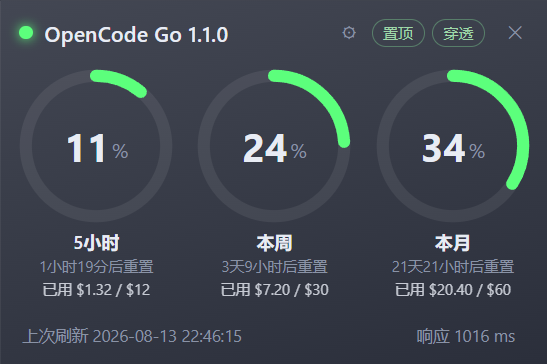

# OpencodeMonitor

> 一个开源的 OpenCode Go 套餐用量监控桌面磁贴 —— 无边框、置顶、可鼠标穿透的悬浮小部件，实时展示三个时间窗口的用量与本地 token 消耗统计。


## 简介

OpencodeMonitor 是运行在 Windows 桌面上的一枚半透明磁贴，通过 OpenCode 官方用量接口
`GET https://opencode.ai/zen/go/v1/usage` 拉取 **OpenCode Go** 订阅计划的配额用量，
并用三个环形图实时展示：

- **5 小时（rolling）** 滚动窗口用量
- **本周（weekly）** 自然周用量
- **本月（monthly）** 订阅周期用量

每个环同时给出中心百分比、重置倒计时和按官方配额换算的已用美元金额（5 小时 = $12、每周 = $30、每月 = $60）。

右侧的**今日 token 统计**列展示今日的 总 token / 输入 / 输出 / 缓存 / 缓存率，来自本机
**综合采集**（OpenCode、Claude Code、pi、ZCode、Codex，详见[数据来源](#数据来源与口径)），
即使监测程序未运行期间产生的消耗，下次启动也会自动补全。

## 功能特性

- 🎨 **三环形用量图**：5 小时 / 本周 / 本月百分比 + 重置倒计时 + 已用美元（`已用 $X.XX / $Y`）
- 📈 **今日 token 统计**：今日总 / 输入 / 输出 / 缓存 / 缓存率，右侧竖排、数值等宽底色块（数字自动缩写 `k`/`M`/`B`）
- 📊 **用量统计窗口**：月度 token 日历（色块深浅 = 当日用量），仅显示有消耗的月份、切换月份即时无感；
  悬浮日期显示当日明细；窗口位置退出保存、下次打开原位恢复
- 🔄 **综合采集**：合并 OpenCode、Claude Code、pi、ZCode、Codex 五个本地数据源，历史消耗自动补全
- 🖱️ **鼠标穿透 / 置顶**：可一键切换，作为悬浮磁贴不挡操作
- ⚙️ **主题自定义**：背景透明度、背景色、强调色，实时预览并持久化（不透明度只作用于窗口基底，控件位置与配色恒定）
- 🔔 **托盘常驻**：窗口不进任务栏与 Alt+Tab，仅通过托盘图标操作（显示窗口 / 用量统计 / 置顶 / 穿透 / 退出）
- 📍 **位置记忆**：退出时记住窗口位置，下次启动原位恢复
- ⏱️ **响应耗时**：底部实时显示每次接口请求的毫秒耗时
- 🔑 **内嵌 API Key 配置**：未配置或 Key 无效时自动弹出填写面板，保存后立即重连
- 📦 **一键安装 / 覆盖升级**：Inno Setup 安装包，重装保留 config 与 API Key

## 截图



## 安装

从 [Releases](../../releases) 下载最新安装包 `OpencodeMonitor-Setup-<版本号>.exe`，双击安装即可。

> 安装包会自动定位已安装的旧版本目录并原地覆盖升级，`config.json` 与 API Key 会被保留。

## 使用

1. 启动后，如果尚未配置 API Key，磁贴会弹出填写面板。
2. 填入你的 OpenCode Go API Key（`sk-...`），点击 **保存并连接**。
3. 磁贴开始每 60 秒刷新一次用量数据（可在 `config.json` 调整刷新间隔）。

托盘图标右键菜单：

| 菜单项 | 说明 |
| ------ | ---- |
| 显示窗口 | 重新显示磁贴 |
| 置顶 | 切换窗口始终置顶 |
| 鼠标穿透 | 切换点击穿透（穿透后可通过托盘菜单恢复） |
| 退出 | 退出程序 |

磁贴右上角 **✕** 按钮是最小化到托盘（并非退出）。

## 配置

程序在安装目录下生成 `config.json`，所有可选项：

| 键 | 类型 | 默认值 | 说明 |
| --- | ---- | ------ | ---- |
| `api_key` | string | `""` | OpenCode Go API Key |
| `refresh_seconds` | int | `60` | 用量刷新间隔（秒） |
| `bg_color` | string | `"#1e2330"` | 卡片背景色 |
| `bg_opacity` | number | `1.0` | 背景不透明度 0~1（只作用于窗口基底） |
| `accent_color` | string | `"#5b9bff"` | 强调色（环形图、状态圆点、日历色块） |
| `window_x` / `window_y` | int\|null | `null` | 上次退出时主窗口位置（物理像素） |
| `stats_window_x` / `stats_window_y` | int\|null | `null` | 上次退出时用量统计窗口位置（物理像素） |
| `topmost` | bool | `true` | 启动时是否置顶 |
| `click_through` | bool | `true` | 启动时是否鼠标穿透 |

> 背景透明度为 0 时，卡片完全透明、只显示文字与图形。不透明度只改变窗口基底，所有控件的位置、尺寸与配色保持不变。

## 从源码构建

环境要求：Python 3.12、[PyInstaller](https://pyinstaller.org/)、[Inno Setup 7](https://jrsoftware.org/isinfo.php)。

```bash
# 1. 安装依赖
pip install pywebview pystray pillow

# 2. 源码运行（开发调试）
python -m core.main

# 3. 打包 exe（PyInstaller）
python -m PyInstaller --noconfirm --clean OpencodeMonitor.spec

# 4. 生成安装包（Inno Setup）
"/c/Program Files/Inno Setup 7/ISCC.exe" installer.iss
```

构建产物：
- `dist/OpencodeMonitor/` —— 绿色免安装目录（`OpencodeMonitor.exe` + `_internal/`）
- `installer/OpencodeMonitor-Setup-<版本号>.exe` —— 安装包

> 升级版本号：改 `installer.iss` 的 `#define MyAppVersion` 与 `index.html` 的 `VERSION` 常量即可，
> 安装包文件名会自动带上版本号。

## 技术栈

| 组件 | 用途 |
| ---- | ---- |
| [pywebview](https://pywebview.flowrl.com/)（WebView2 后端） | 无边框透明窗口 + 前端渲染 |
| [pystray](https://pystray.readthedocs.io/) | 系统托盘图标与菜单 |
| [PIL/Pillow](https://python-pillow.org/) | 托盘图标绘制（代码自绘，非网络素材） |
| PyInstaller | Python 打包为独立 exe |
| Inno Setup | 安装 / 卸载 / 覆盖升级 |

## 项目结构

```
OpencodeMonitor/
├── core/                   # 核心代码包（高内聚低耦合，按职责拆分）
│   ├── main.py             # 入口：窗口创建、主题注入、boot 时序、线程装配
│   ├── config.py           # 配置读写、默认值、主题键、位置/开关持久化
│   ├── state.py            # 共享状态：窗口引用、缓存、锁、事件
│   ├── win32.py            # 原生窗口：置顶/穿透/任务栏隐藏/位置保存
│   ├── opencode.py         # OpenCode 用量 API 拉取与轮询循环
│   ├── stats.py            # 本地 token 统计：五数据源采集聚合
│   ├── api.py              # pywebview JS 桥（Api）+ 统计窗口生命周期
│   └── tray.py             # 系统托盘图标与菜单
├── index.html              # 前端界面：三环图、今日统计、配置面板、主题
├── stats.html              # 用量统计窗口：月度 token 日历
├── OpencodeMonitor.spec    # PyInstaller 打包配置
├── installer.iss           # Inno Setup 安装脚本
├── icon.ico                # 应用/窗口图标（与托盘图标同款自绘）
├── config.json             # 用户配置（安装时生成，含 API Key，勿提交）
├── docs/                   # 文档与截图
├── dist/                   # 打包产物
└── installer/              # 安装包输出
```

## 数据来源与口径

用量数据来自两个层面：

- **配额用量（三环图）**：OpenCode 官方接口 `GET https://opencode.ai/zen/go/v1/usage`，认证需要同时携带
  `Authorization: Bearer <key>` 与 `x-api-key: <key>` 两个请求头（详见 [docs/adr/0001-use-official-usage-api.md](docs/adr/0001-use-official-usage-api.md)）。
  接口只返回 0–100 的整数百分比，因此"已用美元"按官方配额换算：**5 小时 = $12、每周 = $30、每月 = $60**。
  这与官网仪表盘口径一致。

- **今日统计与月度日历（token 消耗）**：综合采集本机五个数据源，合并后按天聚合——
  - opencode 本地库 `~/.local/share/opencode/opencode.db`（message 表，含 tokens 明细）
  - Claude Code 会话记录 `~/.claude/projects/*.jsonl`（assistant 消息的 usage）
  - pi 会话记录 `~/.pi/agent/sessions/**/*.jsonl`
  - ZCode CLI 用量库 `~/.zcode/cli/db/db.sqlite`
  - Codex CLI 会话记录 `~/.codex/sessions/**/*.jsonl`

  统计口径为 `total = input + output + cache_read + cache_write`，缓存率 = `cache_read ÷ (cache_read + input)`。
  因为都是外部工具自身写入的原始记录，监测程序未运行期间产生的消耗，下次启动会**自动补全**，
  且不局限于 OpenCode Go 套餐。

## 许可证

本项目基于 [MIT License](LICENSE) 开源。
